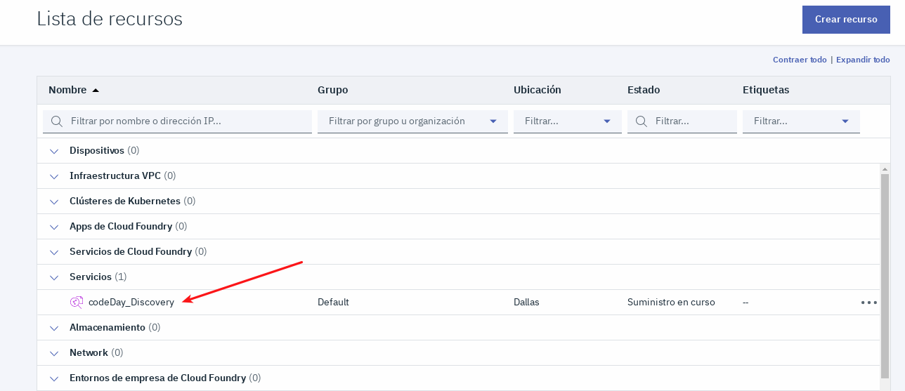

# WORKSHOP sobre Watson Discovery Service + Watson Knowledge Studio : 

Cree un buscador cognitivo que sea capaz de realizar consultas sobre documentos no estructurados, auxiliandose con un modelo de Machine Learning creado en WKS

  

# Resumen

En la actualidad estamos muy familiarizados a tratar con buscadores de muchos tipos. Desde que ingresamos a Google y utilizamos su buscador para algún tipo de información, Mercado Libre cuando queremos buscar algo para comprar y mas. En el ejemplo que realizaremos en este Workshop, vamos a ver el potencial de estos dos servicios que se encuentran en IBM Cloud: Watson Discovery y Watson Knowledge Studio. El primero nos va a permitir alojar los documentos no estructurados para poder realizar las búsquedas en lenguaje natural o búsquedas filtradas, y el segundo servicio es el que nos permite crear el modelo de Machine Learning que restringe el dominio de nuestro buscador y se adapta mejor a nuestras consultas. Con la combinación de los dos, formamos nuestro buscador cognitivo.

# Descripción

En este Workshop crearemos un buscador donde las consultas seran sobre documentos no estructurados que contienen información sobre empresas de Software,Hardware o ambas. La idea es que el buscador sea capaz de diferenciar estas empresas mediante consultas filtradas mostrandonos la informacion sobre que empresas son de software, asi como tambien cuales son de hardware y alguna otra consulta que pregunte sobre el tipo de solución que las mismas brindan. Lo que vamos a hacer es crear una instancia del servicio WDS y otra del servicio WKS en nuestra cuenta de IBM Cloud. Luego vamos a crear el modelo de ML desde el servicio correspondiente como mencionamos anteriormente utilizando datos que se encuentran en este Workshop. Desplegaremos el modelo desde WKS sobre nuestra instancia de WDS y luego realizaremos algunas consultas filtradas para ver como el modelo enriquece los documentos y mejora nuestras consultas. Todo sera sobre la nube de IBM. Tambien al finalizar se hablaran sobre posibles mejoras incluyendo otros servicios y problemas que se pueden abordar con esto.

# Pre- Requisitos

Tener una cuenta en IBM Cloud. <a href="https://cloud.ibm.com/registration">Link para registrarse en IBM Cloud</a>

# Arquitectura

  

# Usando Discovery sin modelo

Bueno para comenzar, el primer paso es crear una instancia del servicio Watson Discovery. Para esto, nos dirigimos al catalogo de IBM Cloud, en las categorias seleccionamos Inteligencia Artificial (AI) y luego buscamos el servicio nombrado anteriormente

  

Luego, para instanciar el servicio debemos darle un nombre al mismo, la region en la cual va a ser desplegado y seleccionar el plan Lite que la mayoria de los servicios de la nube provee. Vamos a ponerle de nombre 'codeDay_Discovery' y la region 'Dallas'

  

Una vez pronto todo lo anterior, damos click en 'Crear'. 
Como se ve en la imagen, las flechas amarillas nos muestran dos items importantes que contienen la mayoria de los servicios de la nube de IBM. El primero 'Ver documentos' refiere a toda la documentacion del servicio. Podemos acceder a ese link para saber mas sobre el servicio, todas sus capacidades y utilidades. Mientras que el segundo item es toda la documentacion referida a la API del mismo. En este Workshop realizaremos todo en la nube pero si quisieramos crear una app que la misma haga uso de este servicio, este item es fundamental ya que contiene toda la informacion necesaria para vincular el servicio con nuestra aplicación.

Ya creado el servicio vamos a acceder. Nos dirigimos a nuestra Lista de Recursos en el panel de la izquierda

  

Se mostraran los recursos que tenemos instanciados. Vamos a clickear la instancia de Watson Discovery

  

Y para ingresar clickeamos el boton que dice 'Iniciar Watson Discovery'. 

  

Nuevamente como marcan las flechas amarillas, desde esta seccion podemos tambien ingresar a la documentacion del servicio y a la API. Tambien podemos ver los planes y que nos ofrecen cada uno. Y las credenciales de identificación que son las que nos permiten vincular nuestro servicio con nuestra APP.

Dentro del servicio, vamos crear una coleccion donde vamos a subir nuestros documentos. Para esto, clickeamos en el boton 'Upload your own data', se nos abrira una ventana clickeamos en 'Set up with current plan'

  

Luego nos pedira que le demos un nombre a la coleccion, vamos a ponerle 'codeDay_empresas' y seleccionamos el idioma 'Spanish'. 

  

En esta coleccion guardaremos los documentos de la carpeta Empresas ubicada en este repositorio. Estos documentos contienen información no estructurada de algunas empresas y estan todos en español, debido a esto es que seleccionamos la opcion Spanish al crear la colección. Subimos los documentos clickeando en 'select documents' y esperamos a que Discovery normalice estos documentos nos estructurados.

  

Con los documentos pronto en nuestra colección. Vamos a realizar dos consultas en lenguaje natural.
Nos dirigimos al item de 'Build queries' y seleccionamos la opcion 'Search for documents'

  

Vamos a crear la consulta 'empresas que desarrollen software' y nos va mostrar empresas que en su informacion contienen como tipo de solución al software

  

Y ahora hacemos la consulta siguiente: 'empresas que desarrollan software y no hardware'

  

Se ven en los resultados, que nos trae las empresas que realizan software pero tambien que trabajan con Hardware. Esto se debe a que el modelo predeterminado de Discovery no esta entrenado para diferenciar estos conceptos.

# Generar el modelo con WKS

Vamos a crear nuestra instancia de WKS. Nos dirigimos al catalogo de la nube de IBM, seleccionamos la categoria 'AI' y luego seleccionamos el servicio 'Watson Knowledge Studio'

  

De igual manera que en Discovery, le damos el nombre 'codeDay_WKS', la region Dallas y el plan Lite. Iniciamos el servicio

  

Seleccionamos la opcion 'Create entities and relations workspace', le ponemos de nombre 'codeDay_modelo' y los documentos en idioma español

  

Vamos a cargar los documentos, en el panel de la izquierda seleccionamos 'Documents' y subimos los mismos documentos de la carpeta Empresas

  

Luego, en la seccion de Entidades, vamos a subir el archivo Entidades.json de este repositorio. Esto cargara dos entidades con las cuales vamos a entrenar el modelo

  

Para seguir, en la seccion de Diccionarios, vamos a crear dos diccionarios de nombre 'dicSoluciones' y 'dicIndustrias' respectivamente. Una vez creados vamos a seleccionar que estos diccionarios se vinculen con las entidades creadas correspondientes y luego cargamos los diccionarios que tambien se encuentran en este respositorio con los mismos nombres.
***Importante: Se deben crear los diccionarios, no importarlos, y una vez creados importar los archivos CSVs correspondientes como indica la imagen***

  

Ya tenemos las entidades con sus respectivos diccionarios prontos para anotar los documentos para que el modelo se entrene. Vamos a la seccion de Machine Learning model, clickeamos en Pre-annotation y luego en 'Apply this Pre-annotator'. Esto hara que los documentos se anoten automaticamente usando los diccionarios asociados a las entidades.

  

Seleccionamos el set de documentos cargados y damos en Run. Luego que la anotacion automatica termino, vamos a la seccion de Annotations donde vamos a verificar que nuestros documentos quedaron anotados de forma correcta.

  

Para esto, creamos una tarea de anotación donde le damos el nombre de 'tarea_anotación' y le damos una fecha limite de unos cuantos dias posteriores. 

  

Creamos un set de anotación, donde seleccionaremos el 100% de los documentos cargados y el anotador encargado de etiquetar estos documentos, que en este caso seremos nosostros. Le damos el nombre 'set_anotación'

  

Generamos, guardamos y listo. Entramos en nuestra tarea de anotación. Seleccionamos la opción Annotate y luego se nos mostrara la lista de documentos para anotar. Abrimos el primero y verificamos que los diccionarios hayan anotado de forma correcta relacionando la información con las entidades.

  

  

Verificamos esto con los demas documentos y si alguna entidad no quedo marcada, lo realizamos de forma manual.

Para terminar la anotación, clickeamos en 'Submit all documents'

  

Volvemos a la seccion de Annotations, clickeamos la tarea y aceptamos los cambios enviados

  

Ahora solo nos queda entrenar nuestro modelo con los datos que etiquetamos y luego desplegarlo sobre Discovery. Vamos a la seccion de Performance y clickeamos en Train and Evaluate. Seleccionamos nuestro set de anotacion y damos en Train & Evaluate

  

Nuestro modelo quedara entrenando por unos minutos. En la seccion de Versions haremos el despliegue de nuestro modelo cuando su entrenamiento finalice. Damos en 'Create Version'

  

Luego en Deploy, seleccionamos Discovery y tenemos que seleccionar la region donde se encuentra nuestro servicio, el Resource Group y luego la instancia

  

Desplegamos y nos copiamos el Model ID para utilizarlo en Discovery una vez que el modelo este desplegado. Esto puede tardar unos minutos mientras verificamos el status del modelo, cuando este sea 'Deployed' estamos listos para volver a Discovery.

# Usando Discovery con modelo

Vamos a borrar la coleccion que habiamos creado y crear una nueva vacia con el mismo nombre. Luego de esto con la coleccion vacia vamos a 'Configure Data'

  

Luego vamos a la pestaña 'Enrich Fields' y clickeamos en 'Add enrichments'

  

En donde dice Entity Extraction vamos a pegar el Model ID de nuestro modelo recientemente creado para que extraiga las entidades de los documentos haciendo uso del mismo. Click en Apply y despues en Apply changes to collection.

Ahora si estamos listos para subir nuevamente los documentos. Una vez cargados los documentos para ver la extraccion de entidades que el modelo realiza al normalizar los documentos. Tambien vamos a subir el documento que no utilizamos para el entrenamiento que se llama 'Empresa_test' del repositorio.

  

Vamos a la pestaña de Document View, y seleccionamos el documento de test que utilizamos 'centromac.pdf'
Si vemos en la normalización de los datos, nos muestra las entidades que extrajo el modelo. Podemos ver estos mismos datos de cada uno de los documentos.

  

Para finalizar con este Workshop, vamos a realizar las consultas. 
Vamos al item 'Build queries' en el panel de la izquierda y vamos a realizar una consulta filtrada. Seleccionamos nuevamente 'search for documents'.

***IMPORTANTE*** El modelo actua sobre los documentos no sobre las consultas en lenguaje natural. Al finalizar el workshop veremos como esta solucion se podria extender para generar un buscador que procese la consulta en lenguaje natural y sea mas inteligente que los buscadores convencionales.

Clickeamos en la pestaña 'Use the Discovery Query Language' y armamos dos grupos de reglas. En un grupo vamos a pedir que traiga los documentos que contienen como entidades el 'software' y el otro grupo el 'hardware' como muestra la imagen

  

En la imagen vemos que una de las flecha nos indica: 'Satisfy ***all*** of the following rules', esto indica que los documentos que se van a traer con esta query debe satisfacer TODAS estas reglas. Si cambiamos por la otra opción ***any*** va a traer los documetos que satisfacen alguna de las reglas.

Entonces vamos a realizar la consulta que haciamos en lenguaje natural de 'empresas que trabajan con software y hardware' como muestra la siguiente imagen:

  

Esta consulta trae 10 de los 11 documentos ya que una de la empresas 'Armor Bionics' no es de software ni de hardware, o al menos asi fue entrenada.

Ahora vamos a la consulta de las empresas que desarrollan software pero no trabajan con hardware

  

Vemos que nos trae 7 documentos lo cual es correcto por que dos de las empresas, 'IBM' e 'IGV', si trabajan con Hardware, una empresa solo trabaja con Hardware y una con ninguna de las dos.
Y asi podemos seguir filtrando las consultas para hacer un buscador mas exacto.
Para terminar, podemos seleccionar la opcion 'Edit in query language' que esta opción es muy importante cuando hacemos las consultas por API, este es el String que se utiliza para que Discovery nos devuelve un JSON con los resultados correspondientes

  

  

# MEJORAS 

Damos por finalizado el Workshop. Para terminar de realizar el buscador inteligente se deberia entrenar un modelo de procesamiento de lenguaje natural que sea capaz de diferenciar intenciones de tipo 'software' 'noSoftware' 'hardware' 'noHardware' que esto se puede realizar utilizando NLU otro servicio de la nube o Watson Assistant. Este modelo procesaria la consulta en lenguaje natural extrayendo las entidades correspondiente y en base a la mismas realizar la consulta en Query Language a Discovery de la manera correspondiente.

